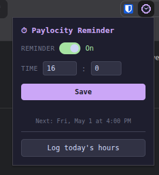
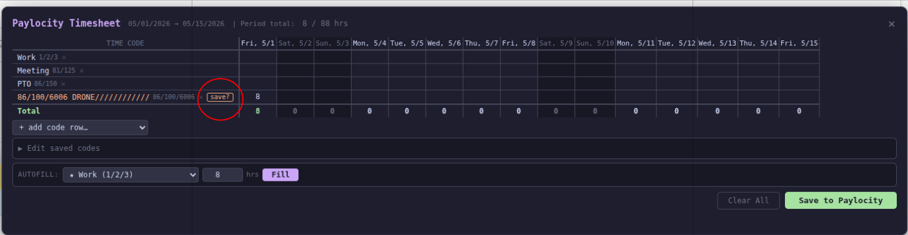
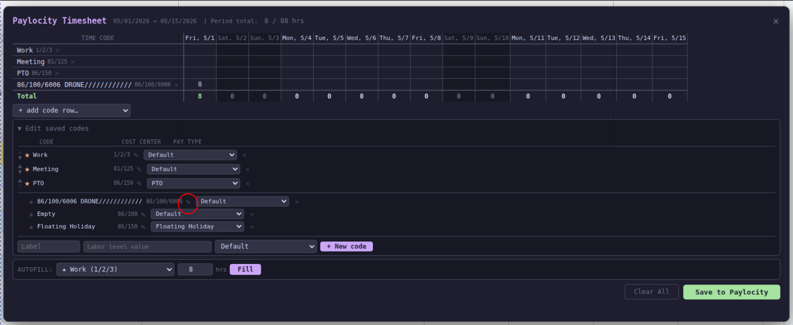
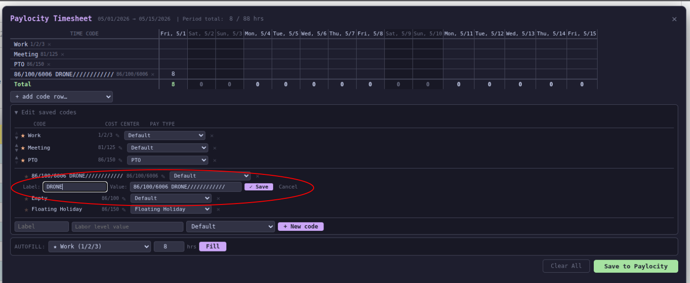
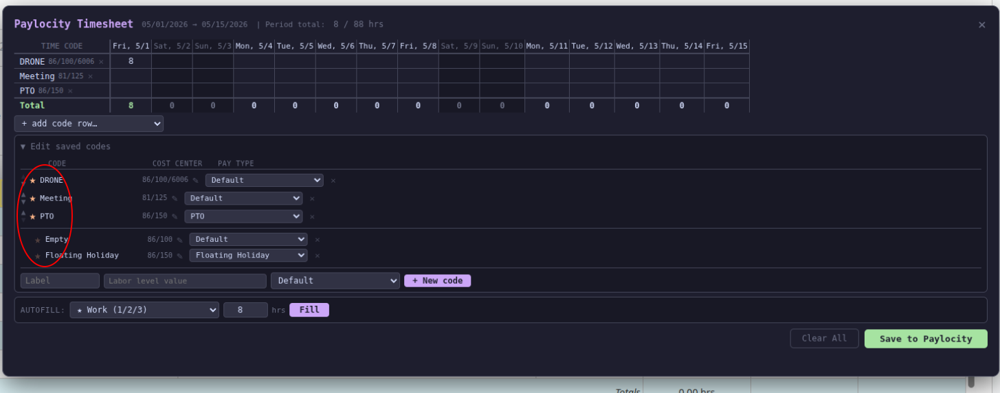
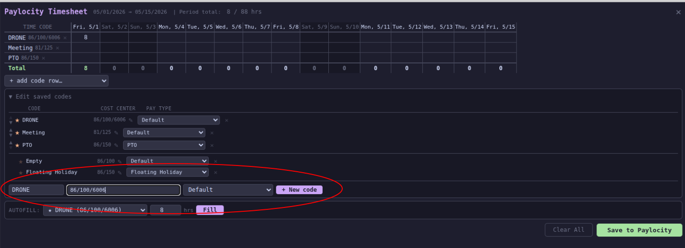
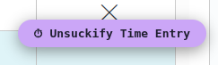
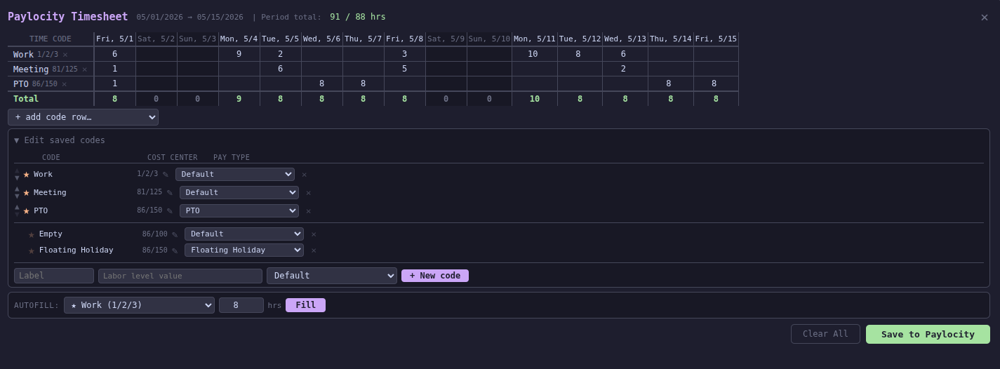
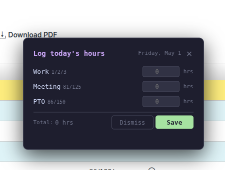

# Paylocity Clean Timesheet

A Chrome/Brave extension that replaces Paylocity's timesheet UI with a fast, keyboard-navigable grid and a configurable daily reminder.

---

## What it does

- Replaces the Paylocity timesheet with a clean spreadsheet-style grid
- Daily alarm notification at a time you choose (weekdays only)
- "Log today's hours" quick-entry modal from the notification or extension popup
- Saves your job codes locally — favorites show in the grid, others are one click away
- Keyboard navigation (arrow keys) and Escape to close
- Autofill: fill an entire week with one click

---

## Installation

### Step 1 — Download the extension

Download the latest `paylocity-extension.zip` from this repo and extract it.

### Step 2 — Open Chrome Extensions

In Chrome, go to `chrome://extensions` or open the menu → **More tools** → **Extensions**.

### Step 3 — Enable Developer Mode

Toggle **Developer mode** on (top-right corner of the Extensions page).

### Step 4 — Load the extension

Click **Load unpacked** and select the extracted `paylocity-extension/` folder.

### Step 5 — Confirm it loaded

You should see **Paylocity Clean Timesheet** appear in your extension list with a clock icon. Pin it to your toolbar for easy access.

---

## Setting up your job codes

Job codes are the labor level values Paylocity uses to categorize your hours. You'll need to add your own values to match your organization's setup.

### Adding codes via the UI

1. Navigate to your Paylocity timesheet.
2. Click **⏱ Unsuckify Time Entry** (bottom-right of the page).
3. Expand **Edit saved codes** → scroll to the bottom → fill in **Label** and **Value** → click **+ New code**.
4. Star (★) the codes you use most — starred codes appear as rows in the main grid.

---

## Saving job codes

There are two ways to save a job code.

### Option A — Save a code from your existing timesheet

If you already have hours logged in Paylocity under a code the extension doesn't recognize yet, it will appear as an orange row in the grid with a **save?** button next to it.

Click **save?** to add it to your saved codes list. Then expand **Edit saved codes** and click the pencil (✎) icon next to it to rename it to something readable.

Type a label and confirm with **✓ Save**.

The code is now saved and will appear in your list. Star it (★) to make it show as a row in the main grid.

### Option B — Add a code manually

If you know the labor level value, you can add it directly. Expand **Edit saved codes**, fill in the **Label** and **Labor level value** fields at the bottom, optionally set a pay type, and click **+ New code**.

---

## Daily usage

### Opening the timesheet panel

Click **⏱ Unsuckify Time Entry** in the bottom-right corner of any Paylocity timesheet page.

### The grid

| Column | What it shows |
|--------|--------------|
| Time Code | Your favorited job codes (label + cost center) |
| Mon–Fri columns | Editable hour inputs |
| Total row | Per-day totals, color-coded (green ≥ 8h, orange < 8h) |
| Period total | Sum vs. target for the pay period |

- Type hours directly into any cell
- Use **arrow keys** to move between cells
- Press **Escape** to close the panel
- Click **Clear All** to zero every cell
- Click **Save to Paylocity** to submit

### Autofill

Select a job code and an hour value, then click **Fill** to populate all empty weekday cells for that code at once.

### Adding a code row for one-off entries

Use the **+ add code row…** dropdown above the grid to add a non-favorite code as a temporary row for the current session.

---

## Reminder setup

Click the extension icon in your Chrome toolbar to open the popup.

| Control | What it does |
|---------|-------------|
| Reminder toggle | Turn the daily alarm on or off |
| Time inputs | Hour (0–23) and minute (0–59) in 24-hour format |
| Save | Saves settings and reschedules the alarm |
| Next: | Shows the next scheduled alarm time |
| Log today's hours | Opens Paylocity directly to the quick-entry modal |

### When the alarm fires

A Chrome notification appears at the configured time on weekdays. Click it (or click **Log today's hours** in the popup) to open the quick-entry modal.

### Quick-entry modal

Enter today's hours per job code and click **Save**. The modal submits directly to Paylocity and reloads the page.

---

## Troubleshooting

**"Timesheet still not loaded" alert**
The extension polls for timesheet data for up to 15 seconds after page load. If you see this, try reloading the page and clicking the button again.

**Hours saved but wrong codes appear after reload**
Your labor level values may be slightly wrong. Verify the exact string Paylocity expects by checking the network request in DevTools when saving normally.

**Reminder fires but Paylocity logs me out**
This is normal — Paylocity's session expires. After you log back in, the extension detects you're not on the timesheet and redirects you there automatically, then shows the quick-entry modal.

**Changes to saved codes aren't reflected in the grid**
Close and reopen the panel (click the button twice) to rebuild the grid with updated code data.
